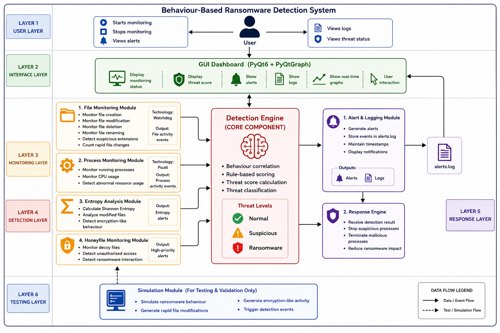
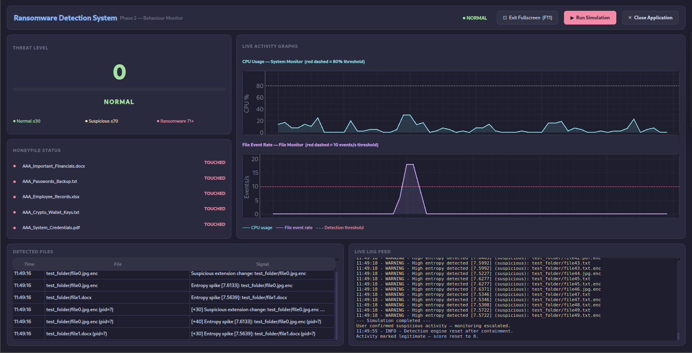
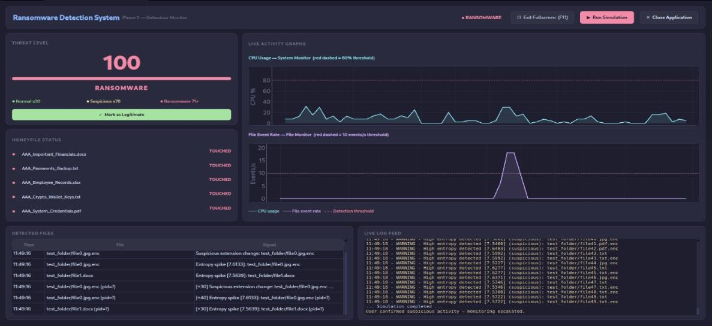
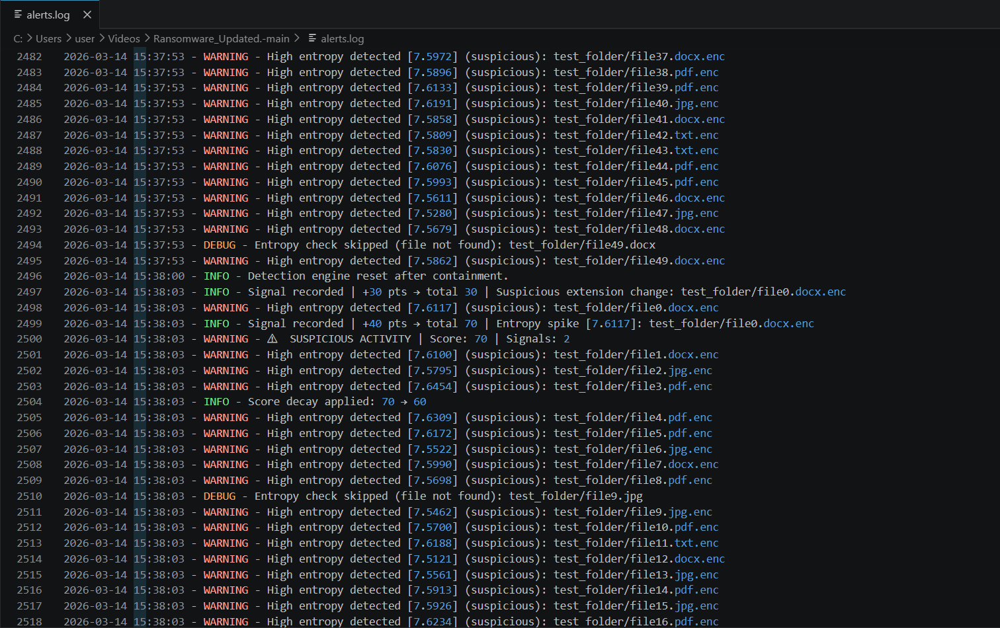

# Ransomware_Behaviour_Detection_System
A behaviour-based ransomware detection system that monitors file activities, process behaviour, entropy changes, and honeyfile access to identify ransomware attacks in real time.
# 🔐 Behaviour-Based Ransomware Detection System

> A real-time, behaviour-based ransomware detection and response system developed in Python.


---

# 📖 Overview

Traditional antivirus solutions primarily rely on signature-based detection methods and may fail to identify new or modified ransomware variants. The Behaviour-Based Ransomware Detection System addresses this limitation by monitoring system activities and identifying suspicious behaviour patterns associated with ransomware attacks.

The system continuously monitors file operations, process behaviour, entropy levels, and honeyfile interactions in real time. When suspicious activities are detected, a rule-based detection engine calculates a threat score and classifies the system state as Normal, Suspicious, or Ransomware. Real-time alerts are generated and logged for further analysis.

---

# ✨ Features

* Real-time file monitoring
* Process and CPU usage monitoring
* Shannon entropy analysis for encrypted file detection
* Honeyfile-based early attack detection
* Behaviour-based threat analysis
* Rule-based threat scoring mechanism
* Real-time alert generation
* Event logging and forensic tracking
* Response engine for threat containment
* PyQt6-based graphical dashboard
* Safe ransomware simulation module for testing

---

# 🏗️ System Architecture

The system follows a modular architecture consisting of monitoring, analysis, detection, logging, and response components.



---

# 🔍 Detection Pipeline

```text
Real System Activity / Simulation Module
                    │
                    ▼

         File Monitoring Module
                    │
                    ▼

       Process Monitoring Module
                    │
                    ▼

        Entropy Analysis Module
                    │
                    ▼

      Honeyfile Monitoring Module
                    │
                    ▼

           Detection Engine
                    │
        ┌───────────┴───────────┐
        ▼                       ▼

 Alert & Logging Module   Response Engine
        │
        ▼

      alerts.log

                    │
                    ▼

             GUI Dashboard
                    │
                    ▼

                  User
```

---

# 📊 Threat Scoring Table

| Behaviour                   | Score |
| --------------------------- | ----- |
| Rapid File Modifications    | +20   |
| Suspicious Extension Change | +30   |
| High CPU Usage              | +10   |
| Entropy Spike               | +40   |
| Honeyfile Access            | +100  |

### Threat Levels

| Score Range | Threat Level |
| ----------- | ------------ |
| 0 – 30      | NORMAL       |
| 31 – 70     | SUSPICIOUS   |
| 71 – 100    | RANSOMWARE   |

---

# 🧩 Modules

## 1. File Monitoring Module

Monitors file creation, modification, deletion, and renaming activities. Detects suspicious extensions and rapid file changes.

## 2. Process Monitoring Module

Tracks running processes and CPU usage to identify abnormal resource consumption.

## 3. Entropy Analysis Module

Calculates Shannon entropy values to detect encrypted or suspicious files.

## 4. Honeyfile Monitoring Module

Deploys decoy files and generates immediate alerts when unauthorized access occurs.

## 5. Detection Engine

Acts as the core decision-making component. Combines behavioural indicators and calculates threat scores.

## 6. Alert & Logging Module

Generates alerts and stores all detection events in the `alerts.log` file with timestamps.

## 7. Response Engine

Attempts to stop suspicious processes and reduce ransomware impact.

## 8. Simulation Module

Safely simulates ransomware behaviour for testing and validation purposes.

## 9. GUI Dashboard

Displays monitoring status, threat levels, alerts, logs, and system activity through a graphical interface.

---

# 📸 Screenshots

## Dashboard



## Detection Alert



## Log Output



---

# 📊 Results

The system was tested using a safe ransomware simulation environment without using real malware.

### Key Results

* Successfully detected ransomware-like behaviour in real time
* Detected rapid file modifications and suspicious file extensions
* Identified abnormal CPU usage and process activity
* Detected encryption-like behaviour using entropy analysis
* Generated real-time alerts and event logs
* Successfully detected honeyfile access attempts
* Maintained low CPU and memory usage during monitoring
* Demonstrated effective early-stage ransomware detection

---

# 🚀 Installation

## Prerequisites

```bash
python3 --version

pip install PyQt6 pyqtgraph watchdog psutil
```

## Clone Repository

```bash
git clone https://github.com/YOUR_USERNAME/Behaviour-Based-Ransomware-Detection-System.git

cd Behaviour-Based-Ransomware-Detection-System
```

## Run Application

```bash
python gui.py
```

---

# 🧪 Running the Simulation

Run the ransomware simulation module:

```bash
python simulate_attack.py
```

The simulation performs:

1. File creation
2. Rapid file modification
3. File renaming with suspicious extensions
4. Encryption-like behaviour
5. Ransomware event generation

The generated events are detected by the monitoring modules and processed by the Detection Engine.

---

# 📁 Log Files

All detection events are stored in:

```text
alerts.log
```

Example:

```text
2026-03-17 09:45:52 - WARNING - Suspicious Activity Detected
2026-03-17 09:45:52 - CRITICAL - Ransomware Detected
2026-03-17 09:45:53 - INFO - Honeyfile Access Detected
```

---

# ⚠️ Known Limitations

* PID correlation is not fully implemented
* Linux-focused implementation
* Behaviour-based detection may miss extremely slow ransomware attacks
* Response engine may require elevated privileges to terminate processes

---

# 🚀 Future Work

* PID correlation for accurate process attribution
* Network-level ransomware monitoring
* Machine learning-based behavioural analysis
* Automated response mechanisms
* Enhanced forensic timeline generation
* Advanced dashboard analytics
* Enterprise-scale deployment support

---

# 👥 Team

Developed as a collaborative cybersecurity mini project by:

- Abhinav MV
- Adhil Rahman PP
- Aswin AS

---

# 📚 Technologies Used

| Technology | Purpose                   |
| ---------- | ------------------------- |
| Python     | Core development language |
| PyQt6      | GUI framework             |
| PyQtGraph  | Real-time visualization   |
| Watchdog   | File monitoring           |
| Psutil     | Process monitoring        |
| Logging    | Event logging             |
| OS Module  | System operations         |

---

# 📄 License

This project is licensed under the MIT License.

---

# 🎓 Academic Project

This project was developed as a cybersecurity mini project focusing on behaviour-based ransomware detection, behavioural analysis, and real-time threat monitoring.

---

> **Disclaimer:** This project is intended for educational and research purposes only. The simulation module is designed for safe testing and does not contain real ransomware.
